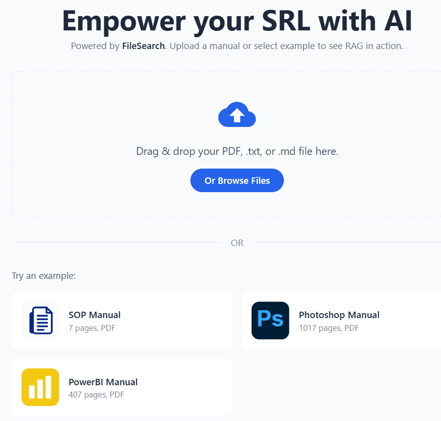
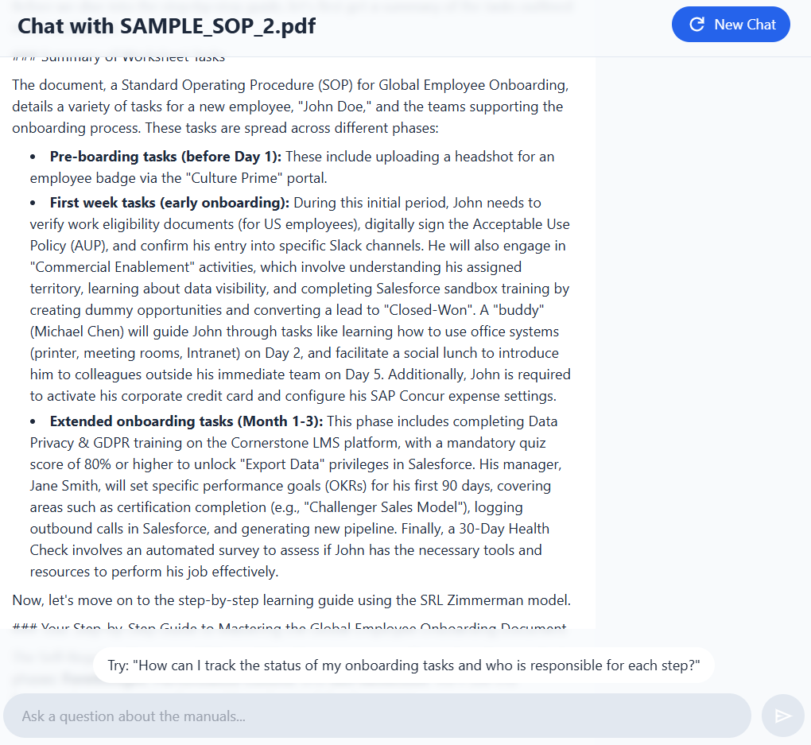

## Run Locally

**Prerequisites:**  Node.js

1. Install dependencies:
   `npm install`
2. Set the `VITE_API_KEY` in [.env.local](.env.local) to your Gemini API key
3. Run the app:
   `npm run dev`

### Clean and intuituive UI

- Allows users to easily upload files into the RAG model. This ensures hallucinations are close to none.
- Moreover, it empowers users to be able to conduct Self Regulated Learning with any corporate material.

### Produces step-by-step guide on how to approach the material

- Provides a tasklist tailored to the prompts of the user. Also, since the application is powered by Gemini LLM, the
user is able to ask the LLM any questions related to the material. 
- Allowing for the user to clarify misconceptions immediately before they exacerbate in the workplace.